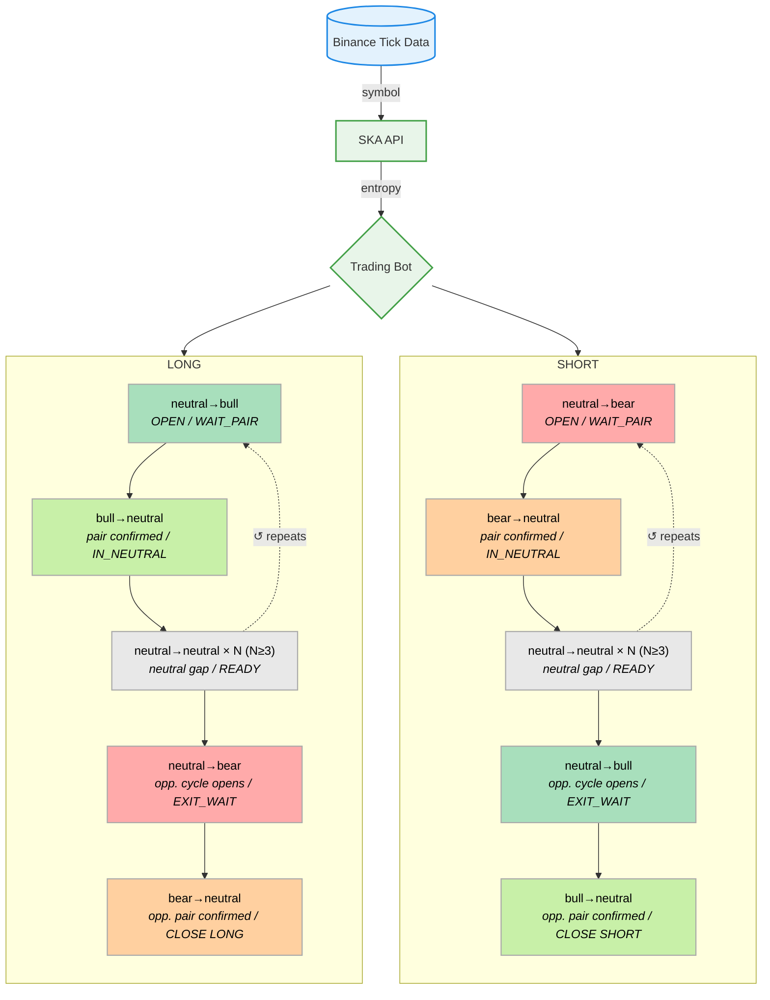

# SKA Binance API
The system does not simulate the market. It observes the market as it truly operates across the nine regime transitions.

## Architecture




## Supported Symbols

`XRPUSDT` · `BTCUSDT` · `ETHUSDT` · `SOLUSDT`


## API

**Base URL:** `https://api.quantiota.org`

### `GET /ticks/{symbol}`

Returns the latest ticks with entropy for the given symbol.

| Parameter | Type | Default | Description |
|-----------|------|---------|-------------|
| `symbol`  | path | —       | Trading pair (`XRPUSDT`, `BTCUSDT`, `ETHUSDT`, `SOLUSDT`) |
| `since`   | query | `0`   | Return only ticks with `trade_id > since` |

**Response**

```json
{
  "symbol": "XRPUSDT",
  "since": 0,
  "count": 3,
  "ticks": [
    {
      "trade_id": 1001,
      "timestamp": "2026-03-18T10:00:00.000000Z",
      "price": 2.3451,
      "volume": 120.5,
      "entropy": 0.182
    }
  ]
}
```


## Monitor

`bot_monitor.py` watches the folder for result CSVs, computes cumulative P&L after each new file, saves a report, and sends it by email.

```bash
export GMAIL_APP_PASSWORD="xxxx xxxx xxxx xxxx"
export GMAIL_FROM="your@gmail.com"
export GMAIL_TO="your@gmail.com"
python bot_monitor.py
```


## Getting Started

**Requirements:** Python 3.9+

```bash
git clone https://github.com/quantiota/SKA-Binance-API.git
cd SKA-Binance-API/ska_api_client
pip install -r requirements.txt
python trading_bot.py --symbol XRPUSDT
```

The bot connects to `https://api.quantiota.org` by default and saves trades to a CSV file (`trading_bot_XRPUSDT_<timestamp>.csv`). The SKA-API restarts and resets every 3500 trades — the bot handles this transparently via the `since` parameter.

**Arguments**

| Argument   | Default                        | Description          |
|------------|--------------------------------|----------------------|
| `--symbol` | `XRPUSDT`                     | Trading pair         |
| `--api`    | `https://api.quantiota.org`   | SKA-API base URL     |
| `--poll`   | `1.0`                         | Poll interval (sec)  |

## Prototype

A ready-to-use trading bot prototype is provided as a starting point. It demonstrates how to consume the API and apply the signal logic — not intended for production deployment.

## User Customization

```python
SYMBOL          = "XRPUSDT"   # XRPUSDT · BTCUSDT · ETHUSDT · SOLUSDT
MIN_NEUTRAL_GAP = 3            # Structural filter
```


## ToDo

- [ ] Add Binance API credentials (key + secret)
- [ ] Define position size
- [ ] Implement order execution on OPEN and CLOSE signals


## Contents

```
├── README.md           — documentation
├── requirements.txt    — dependencies
├── trading_bot.py      — PCT state machine, polls /ticks/{symbol}
└── bot_monitor.py      — scans results, generates reports, sends email
```

## Dashboard

Each panel displays 4 metrics per symbol, reset every 3500 trades: price, regime transition probabilities, accumulated volume, and entropy.

- [XRPUSDT](https://grafana.quantiota.org/public-dashboards/6506763639364be8bab7e6c60cc8432a)

- BTCUSDT

- ETHUSDT

- SOLUSDT

## Contributing

Contributions are welcome — strategy variants, new symbols, execution integrations, or performance improvements.

Open an issue or submit a pull request.

