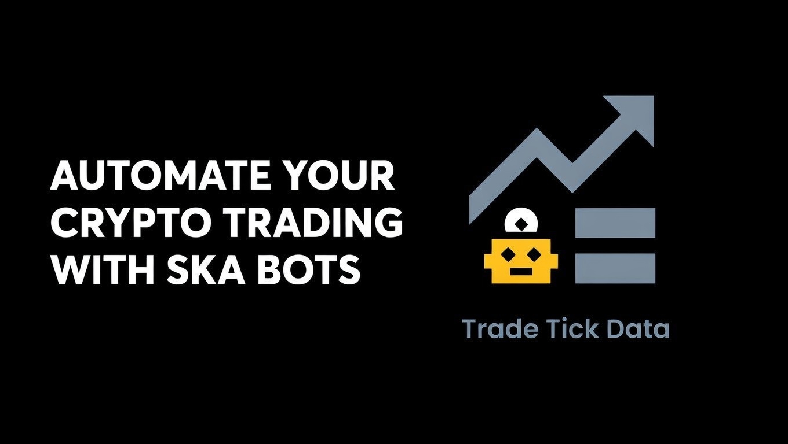
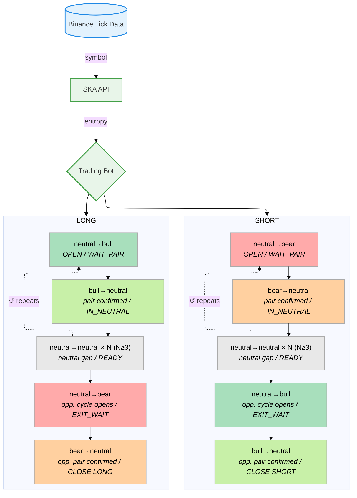

# SKA Binance API



The system does not simulate the market. It observes the market as it truly operates across the nine regime transitions.

**Trade the regime transition. Ride the wave.**

The "signal" is the market's own structure firing — neutral→bull is not a computed indicator, it is a regime transition event. The market generates it itself. SKA reads it.

The market looks chaotic — random price movements, noise, unpredictable events. But underneath, the regime transition probabilities are stationary. Chaos would mean the transition matrix is random. It is not. It is stable and non-uniform. That non-uniformity is the structure SKA learns.

The market is a deterministic process in probability space — not in price space. Everyone looks at price and sees chaos. SKA looks at entropy and sees order.

## Architecture




## Supported Symbols

`XRPUSDT` · `BTCUSDT` · `ETHUSDT` · `SOLUSDT`


## API

**Base URL:** `https://api.quantiota.org`

### `GET /ska_bot/{symbol}`

Returns pre-computed regime transitions for the given symbol. Regime classification is computed server-side.

| Parameter | Type | Default | Description |
|-----------|------|---------|-------------|
| `symbol`  | path | —       | Trading pair (`XRPUSDT`, `BTCUSDT`, `ETHUSDT`, `SOLUSDT`) |
| `since`   | query | `0`   | Return only transitions with `trade_id > since` |

**Response**

```json
{
  "symbol": "XRPUSDT",
  "since": 0,
  "count": 3,
  "transitions": [
    {
      "trade_id": 1001,
      "timestamp": "2026-03-18T10:00:00.000000Z",
      "price": 2.3451,
      "P": 0.1382,
      "transition_code": 2,
      "transition_name": "neutral→bear"
    }
  ]
}
```


## Monitor

`bot_monitor.py` watches the folder for result CSVs, computes cumulative P&L after each new file, saves a report, and sends it by email.

Set your credentials in `bot_monitor.py`:

```python
EMAIL_FROM         = "you@gmail.com"
EMAIL_TO           = "you@gmail.com"
GMAIL_APP_PASSWORD = "xxxx xxxx xxxx xxxx"
```

Then run:

```bash
python bot_monitor.py
```

## Beta Access — SKA API Key

Access to the `/ska_bot/` endpoint requires an API key.

To become a beta tester:

1. **Fork this repository** — this identifies your GitHub account
2. **Email** [info@quantiota.org](mailto:info@quantiota.org) with the subject **"Beta Access Request"** and include a link to your fork

You will receive a personal `SKA_API_KEY` to add to your `.env` file.


## Getting Started

**Requirements:** Python 3.9+

```bash
git clone https://github.com/quantiota/SKA-Binance-API.git
cd SKA-Binance-API/ska_api_client
pip install -r requirements.txt
python trading_bot.py --symbol XRPUSDT
```

The bot connects to `https://api.quantiota.org` by default and saves trades to a CSV file (`bot_results_v2_XRPUSDT_<timestamp>.csv`). The SKA-API restarts and resets every 3500 trades — the bot handles this transparently via the `since` parameter.

**Arguments**

| Argument   | Default                        | Description                         |
|------------|--------------------------------|-------------------------------------|
| `--symbol` | `XRPUSDT`                     | Trading pair                        |
| `--api`    | `https://api.quantiota.org`   | SKA-API base URL                    |
| `--poll`   | `1.0`                         | Poll interval (sec)                 |
| `--live`   | off                            | Enable live Binance order execution |

## Prototype

A ready-to-use trading bot prototype is provided as a starting point. It demonstrates how to consume the API and apply the signal logic — not intended for production deployment.

## User Customization

```python
SYMBOL          = "XRPUSDT"   # XRPUSDT · BTCUSDT · ETHUSDT · SOLUSDT
MIN_NEUTRAL_GAP = 3            # Structural filter
```


## Live Results — XRPUSDT (42 loops · 147,000 ticks)

> Dry-run backtest on live Binance tick stream. Each loop = 3500 trades processed by the SKA engine.

| Metric | Value |
|--------|-------|
| Total trades | 1,145 |
| Win rate | **59.8%** |
| Total PnL | **+2,166 pips** |
| Avg PnL / trade | +1.89 pips |
| Best trade | +23 pips |
| Worst trade | −15 pips |
| Profitable loops | **41 / 42** |

**By side**

| Side | Trades | PnL | Win rate |
|------|--------|-----|----------|
| LONG | 576 | +1,180 pips | 61.6% |
| SHORT | 569 | +986 pips | 58.0% |

The signal is symmetric — both LONG and SHORT are profitable. The only losing loop (loop 28, −32 pips) recovered fully in the next loop (+37 pips). The worst single trade is capped at −15 pips across the entire dataset.


## ToDo

- [x] Add Binance API credentials (Ed25519 key pair)
- [x] Define position size
- [x] Implement order execution on OPEN and CLOSE signals
- [ ] Verify live PnL on XRPUSDT
- [ ] Extend to BTCUSDT · ETHUSDT · SOLUSDT


## Contents

```
├── README.md                   — documentation
├── structural_probability.md   — P band derivation and threshold reference
├── requirements.txt            — dependencies
├── trading_bot.py              — PCT state machine, polls /ska_bot/{symbol}
└── bot_monitor.py              — scans results, generates reports, sends email
```

## Loop Options

```bash
# single run — one engine cycle (3500 ticks), good for testing
python trading_bot.py --symbol XRPUSDT

# continuous loop
while true; do python trading_bot.py --symbol XRPUSDT; done

# multi-symbol in parallel
python trading_bot.py --symbol XRPUSDT &
python trading_bot.py --symbol BTCUSDT &
python trading_bot.py --symbol ETHUSDT &
```


## Dashboard

Each panel displays 4 metrics per symbol, reset every 3500 trades: price, regime transition probabilities, accumulated volume, and entropy.

- [XRPUSDT](https://grafana.quantiota.org/public-dashboards/604695aad6ae47a88e207201880a6dd0)


## Docs
- [Entropy Regime Detection](entropy_regime_detection.md)
- [Structural Probability](structural_probability.md)

## Foundation

**SKA Framework: Open Science, Proprietary Real-Time Engine**

The full mathematical foundation and batch implementation are public for verification on [GitHub](https://github.com/quantiota/Arxiv). The real-time system extends that foundation to continuous entropy learning — that part is proprietary.


## Contributing

Contributions are welcome — strategy variants, new symbols, execution integrations, or performance improvements.

Open an issue or submit a pull request.
