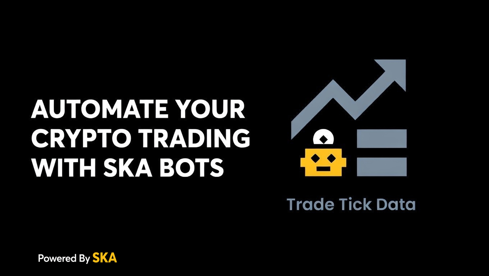
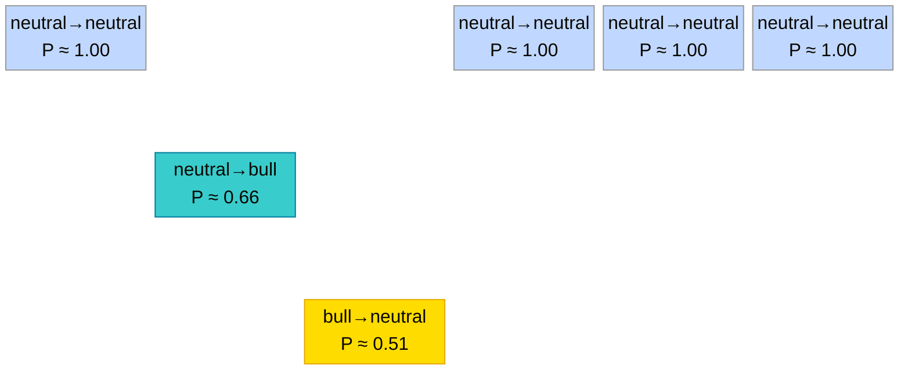
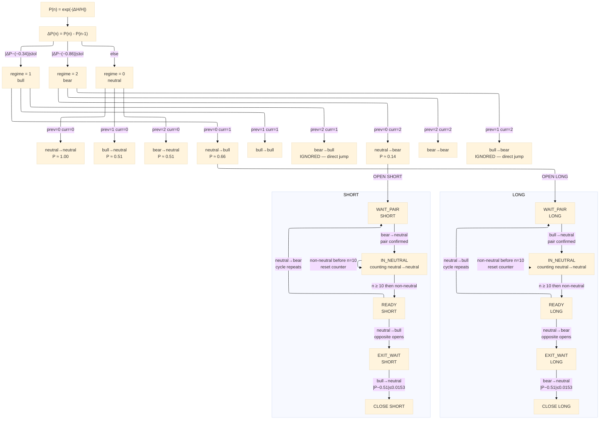

# SKA Binance API

  [](https://arxiv.org/abs/2503.13942)   [](https://arxiv.org/abs/2504.03214)  




## Introduction

The **SKA Binance Trading Bot** is a high-sophistication, entropy-driven trading system that operates on **true tick data** from Binance.

The sophistication is not in the algorithm complexity, not in the number of parameters, not in the model depth. It's in the discovery that market ticks obey a discrete structural grammar.

This project introduces a discrete structural grammar for financial markets, where each consecutive tick pair is mapped to one of nine possible regime transitions. The trading logic is built as a state machine over valid grammatical sequences confirmed by entropy dynamics.


The core innovation is the **paired regime cycle**:
- `neutral-neutral → neutral-bull → bull-neutral → neutral-neutral`  &#x21BA; (LONG pair)





- `neutral-neutral → neutral-bear → bear-neutral → neutral-neutral`  &#x21BA; (SHORT pair)

```mermaid
---
config:
  look: classic
  theme: base
  layout: elk
---

block-beta
  columns 6
  C1["neutral→neutral\nP ≈ 1.00"] space space C4["neutral→neutral\nP ≈ 1.00"] C5["neutral→neutral\nP ≈ 1.00"] C6["neutral→neutral\nP ≈ 1.00"]
  space:6
  space space C3["bear→neutral\nP ≈ 0.51"] space space space
  space:6
  space C2["neutral→bear\nP ≈ 0.14"] space space space space

  classDef nn fill:#c0d8ff,stroke:#999,color:#333
  classDef nb2 fill:#f012be,stroke:#c00090,color:#fff
  classDef bn2 fill:#ff851b,stroke:#cc5500,color:#333

  class C1,C4,C5,C6 nn
  class C2 nb2
  class C3 bn2
  ```

These transitions are not random. Their probability distribution is remarkably stable across time, giving the bot a structural edge rather than a statistical one.

Unlike classical bots that rely on lagging indicators (RSI, Moving Averages, Bollinger Bands, etc.), the SKA bot detects **regime transitions** in real time using structural entropy. It does not predict price — it observes the market’s own internal structure as it shifts between neutral, bull, and bear regimes.

### Why This Matters

- The heavy entropy computation runs on a powerful backend server (heavy matrix computation, entropy learning, 3500 ticks per loop)
- The execution layer (state machine, decision logic, and order placement) must run on AWS Tokyo (`ap-northeast-1`) — Binance matching engine latency from Tokyo is ~5ms. From Europe or the US it is 150–400ms, sufficient to corrupt probe sequence detection and eliminate the structural edge.
- The system is designed to scale as a trading bot farm — multiple independent nodes, each with its own account and PnL stream.

This architecture allows sophisticated quant-level logic to run on modest hardware while maintaining full transparency and control.

**Trade the regime transition. Ride the wave.**

The market generates the signal itself. SKA simply reads it.

## Risk Management

There is no stop loss. The exit condition is structural — the regime transition itself signals when to close a position.

- A **LONG** opens on `neutral→bull` and closes on `bear→neutral`. No price target. No stop loss.
- A **SHORT** opens on `neutral→bear` and closes on `bull→neutral`. No price target. No stop loss.

Risk is not managed by price distance but by market structure. If the regime does not complete its cycle, the position stays open. The regime transition IS the risk management.

This is fundamentally different from classical bots where risk = price distance. Here risk = structural uncertainty of the regime completing its cycle.

## Architecture Diagram

The architecture shown uses QuestDB and Grafana for real-time validation of the trading bot logic on live Binance tick data. This Python-based stack is the research and validation environment. The [production SKA Engine](https://github.com/quantiota/SKA-quantitative-finance/tree/main/ska_engine_c) will be implemented in C++ for low-latency execution.

```mermaid
---
config:
  look: classic
  theme: base
  layout: elk
---
flowchart TD
  BINANCE[(Binance\nRaw Tick Data)]

  subgraph Backend["Backend"]
    direction TB
    ENGINE[SKA Engine]
    QDB[(QuestDB)]
    API[SKA API]
    GRAFANA[Grafana]
  end

  BINANCE -- "ticks" --> ENGINE
  ENGINE -- "entropy" --> QDB
  QDB -- "read" --> API
  GRAFANA -- "queries data" --> QDB

  subgraph TradingSystem["Trading Bot"]
    direction TB

    BOT@{ shape: diamond, label: "State Machine" }
    EXCHANGE[Binance\nREST API]

    subgraph SHORT["SHORT"]
      direction TB
      S1["neutral→bear<br/><i>OPEN / WAIT_PAIR</i>"]
      S2["bear→neutral<br/><i>pair confirmed / IN_NEUTRAL</i>"]
      S3["neutral→neutral × N (N≥3)<br/><i>neutral gap / READY</i>"]
      S4["neutral→bull<br/><i>opp. cycle opens / EXIT_WAIT</i>"]
      S5["bull→neutral<br/><i>opp. pair confirmed / CLOSE SHORT</i>"]
      S1 --> S2 --> S3 --> S4 --> S5
      S3 -. "↺ repeats" .-> S1
    end

    subgraph LONG["LONG"]
      direction TB
      L1["neutral→bull<br/><i>OPEN / WAIT_PAIR</i>"]
      L2["bull→neutral<br/><i>pair confirmed / IN_NEUTRAL</i>"]
      L3["neutral→neutral × N (N≥3)<br/><i>neutral gap / READY</i>"]
      L4["neutral→bear<br/><i>opp. cycle opens / EXIT_WAIT</i>"]
      L5["bear→neutral<br/><i>opp. pair confirmed / CLOSE LONG</i>"]
      L1 --> L2 --> L3 --> L4 --> L5
      L3 -. "↺ repeats" .-> L1
    end

    BOT --> LONG
    BOT --> SHORT
    BOT -- "order" --> EXCHANGE
  end

  API -- "regime transitions" --> TradingSystem

  classDef data      fill:#E3F2FD,stroke:#1E88E5,stroke-width:2px;
  classDef process   fill:#E8F5E9,stroke:#43A047,stroke-width:2px;
  classDef longOpen  fill:#A8DFBC,stroke:#AAAAAA,color:#000,stroke-width:1.5px;
  classDef longPair  fill:#C8F0A8,stroke:#AAAAAA,color:#000,stroke-width:1.5px;
  classDef shortOpen fill:#FFAAAA,stroke:#AAAAAA,color:#000,stroke-width:1.5px;
  classDef shortPair fill:#FFD0A0,stroke:#AAAAAA,color:#000,stroke-width:1.5px;
  classDef neutral   fill:#E8E8E8,stroke:#AAAAAA,color:#000,stroke-width:1.5px;

  class BINANCE,EXCHANGE data;
  class ENGINE process;
  class API,BOT process;

  class L1 longOpen;
  class L2 longPair;
  class L3 neutral;
  class L4 shortOpen;
  class L5 shortPair;
  class S1 shortOpen;
  class S2 shortPair;
  class S3 neutral;
  class S4 longOpen;
  class S5 longPair;
```
## State Machine Diagram

The state machine operates on trade sequence. Each transition is triggered by the structural grammar of consecutive tick pairs — confirmed by entropy dynamics. The regime transition itself is the signal, the confirmation, and the exit condition.

The current state machine is already a structured parser of market transitions, but it is likely only an initial approximation of a deeper discrete structural grammar.

Version 1



[Full size](https://raw.githubusercontent.com/quantiota/SKA-Binance-API/d0d29b2abb445ee2a586ab9e946b9d45378f7f39/images/state-machine-diagram.svg)


[Version 2-3 — probe-aware, compound & detour-aware, sequence-level decision](https://github.com/quantiota/SKA-Binance-API/blob/main/state_machine_diagram.md)

## Supported Symbols

`XRPUSDT` · `BTCUSDT` · `ETHUSDT` · `SOLUSDT` · `BNBUSDT`


## API

**Base URL:** `https://api.quantiota.org`

### `GET /ska_bot/{symbol}`

Returns pre-computed regime transitions for the given symbol. Regime classification is computed server-side.

| Parameter | Type | Default | Description |
|-----------|------|---------|-------------|
| `symbol`  | path | —       | Trading pair (`XRPUSDT`, `BTCUSDT`, `ETHUSDT`, `BNBUSDT`, `SOLUSDT`) |
| `since`   | query | `0`   | Return only transitions with `trade_id > since` |

**Response**

```json
{
  "symbol": "XRPUSDT",
  "since": 0,
  "count": 3,
  "transitions": [
    {
      "trade_id": 1001,
      "timestamp": "2026-03-18T10:00:00.000000Z",
      "price": 2.3451,
      "P": 0.1382,
      "transition_code": 2,
      "transition_name": "neutral→bear"
    }
  ]
}
```


## Monitor

`bot_monitor.py` watches the folder for result CSVs, computes cumulative P&L after each new file, saves a report, and sends it by email.

Set your credentials in `bot_monitor.py`:

```python
EMAIL_FROM         = "you@gmail.com"
EMAIL_TO           = "you@gmail.com"
GMAIL_APP_PASSWORD = "xxxx xxxx xxxx xxxx"
```

Then run:

```bash
python bot_monitor.py
```

## Beta Access — SKA API Key

Access to the `/ska_bot/` endpoint requires an API key.

To become a beta tester:

1. **Fork this repository** — this identifies your GitHub account
2. **Email** [info@quantiota.org](mailto:info@quantiota.org) with the subject **"Beta Access Request"** and include a link to your fork
3. **Backtesting** You can test/improve the logic on [SKA Batch Backtest — Paired Cycle Trading (PCT)](https://github.com/quantiota/SKA-quantitative-finance/tree/main/batch_trading_bot)
4. **Contribution** has nothing to do with optimisation process. A strong logical mindset is required.
5. **API access** available for active contributors.


You will receive a personal `SKA_API_KEY` to add to your `.env` file.


## Getting Started

**Requirements:** Python 3.9+

```bash
git clone https://github.com/quantiota/SKA-Binance-API.git
cd SKA-Binance-API
pip install -r requirements.txt
python trading_bot.py --symbol XRPUSDT
```

The bot connects to `https://api.quantiota.org` by default and saves trades to a CSV file (`bot_results_v2_XRPUSDT_<timestamp>.csv`). The SKA-API restarts and resets every 3500 trades — the bot handles this transparently via the `since` parameter.

**Arguments**

| Argument   | Default                        | Description                         |
|------------|--------------------------------|-------------------------------------|
| `--symbol` | `XRPUSDT`                     | Trading pair                        |
| `--api`    | `https://api.quantiota.org`   | SKA-API base URL                    |
| `--poll`   | `1.0`                         | Poll interval (sec)                 |
| `--live`   | off                            | Enable live Binance order execution |


## Prototype

A ready-to-use trading bot prototype is provided as a starting point. It demonstrates how to consume the API and apply the signal logic — not intended for production deployment.

## User Customization

```python
SYMBOL          = "XRPUSDT"   # XRPUSDT · BTCUSDT · ETHUSDT · SOLUSDT · BNBUSDT 
MIN_NEUTRAL_GAP = 3            # Structural filter
```


## Live Results — XRPUSDT (84 loops · 294,000 ticks)

> Dry-run on live Binance tick stream. Each loop = 3,500 trades processed by the SKA engine.

| Metric | Value |
|--------|-------|
| Total trades | 1,970 |
| Win rate | **48.0%** |
| Total PnL | **+3,756 pips** |
| Avg PnL / trade | +1.91 pips |
| Best trade | +35 pips |
| Worst trade | −32 pips |
| Total pips / trade | 11.6 pips |
| Capture rate | **16.5%** |

**By side**

| Side | Trades | PnL | Win rate |
|------|--------|-----|----------|
| LONG | 1,034 | +2,087 pips | 49.3% |
| SHORT | 936 | +1,669 pips | 46.6% |

The signal is symmetric — both LONG and SHORT are profitable. ΔP_pair is stable across all 84 loops (bull ≈ −0.19, bear ≈ +0.37), confirming SKA convergence and structural consistency of the signal. Capture rate = avg pips/trade ÷ total available pips/trade.


## ToDo

- [x] Add Binance API credentials (Ed25519 key pair)
- [x] Define position size
- [x] Implement order execution on OPEN and CLOSE signals
- [ ] Verify live PnL on XRPUSDT
- [ ] Extend to BTCUSDT · ETHUSDT · SOLUSDT · BNBUSDT 


## Contents

```
├── README.md                   — documentation
├── structural_probability.md   — P band derivation and threshold reference
├── entropy_regime_detection.md — dev analysis
├── requirements.txt            — dependencies
├── trading_bot.py              — PCT state machine, polls /ska_bot/{symbol}
└── bot_monitor.py              — scans results, generates reports, sends email
```

## Loop Options

```bash
# single run — one engine cycle (3500 ticks), good for testing
python trading_bot.py --symbol XRPUSDT

# continuous loop
while true; do python trading_bot.py --symbol XRPUSDT; done

# multi-symbol in parallel
python trading_bot.py --symbol XRPUSDT &
python trading_bot.py --symbol BTCUSDT &
python trading_bot.py --symbol ETHUSDT &
```


## Grafana Dashboard

Each panel displays 8 metrics per symbol, reset every 3500 trades: price, regime transition probabilities, trade order, trade statistic, accumulated volume, and entropy.

- [XRPUSDT](https://grafana.quantiota.org/public-dashboards/1fdf33498b5540b68ebae32bf69e805e)


## Docs
- [Entropy Regime Detection](entropy_regime_detection.md)
- [Structural Probability](structural_probability.md)
- [State Machine Diagram](state_machine_diagram.md)

## Foundation

**SKA Framework: Open Science, Proprietary Real-Time Engine**

The full mathematical foundation and batch implementation are public for verification on [GitHub](https://github.com/quantiota/Arxiv). The real-time system extends that foundation to continuous entropy learning — that part is proprietary.


**Interactive visualization of the SKA forward learning algorithm on MNIST**

- [SKA Explorer](https://huggingface.co/quant-iota)

**SKA Academy**

- [SKA Course](https://quantiota.moodlecloud.com/)


## Contributing

Contributions are welcome — strategy variants, new symbols, execution integrations, or performance improvements.

Open an issue or submit a pull request.


