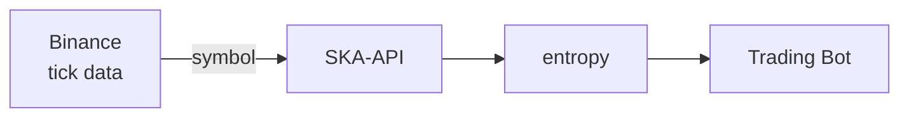

# The True Machine API
The system is called The True Machine because it does not simulate the market. It observes the market as it truly operates.


## Architecture



---

## Supported Symbols

`XRPUSDT` · `BTCUSDT` · `ETHUSDT` · `SOLUSDT`

---

## Prototype

A ready-to-use trading bot prototype is provided and can be customized.

# Uer Customization
```python
SYMBOL          = "XRPUSDT"
MIN_NEUTRAL_GAP = 3        # Structural filter
```