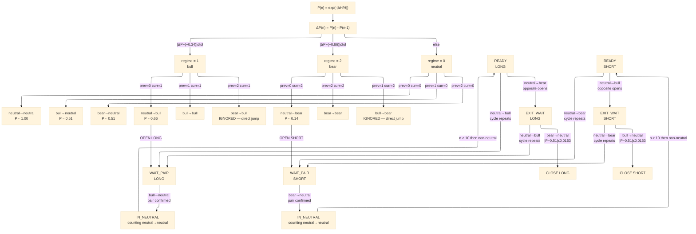
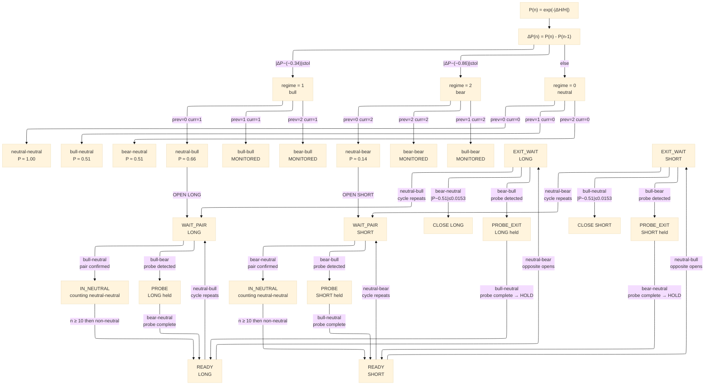

## State Machine Diagram

### Version 1

### Version 2 — probe-aware, sequence-level decision

Direct jumps (bull-bear, bear-bull) are no longer ignored — they signal a probe sequence and trigger HOLD.

**Probe sequences:**
- `5760`  : `0000 → neutral-bull → bull-bear → bear-neutral → 0000`  dp=0  → HOLD LONG
- `10560` : `0000 → neutral-bear → bear-bull → bull-neutral → 0000`  dp=0  → HOLD SHORT

