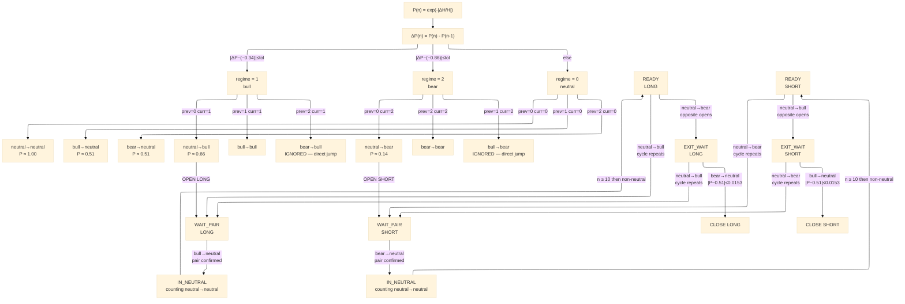
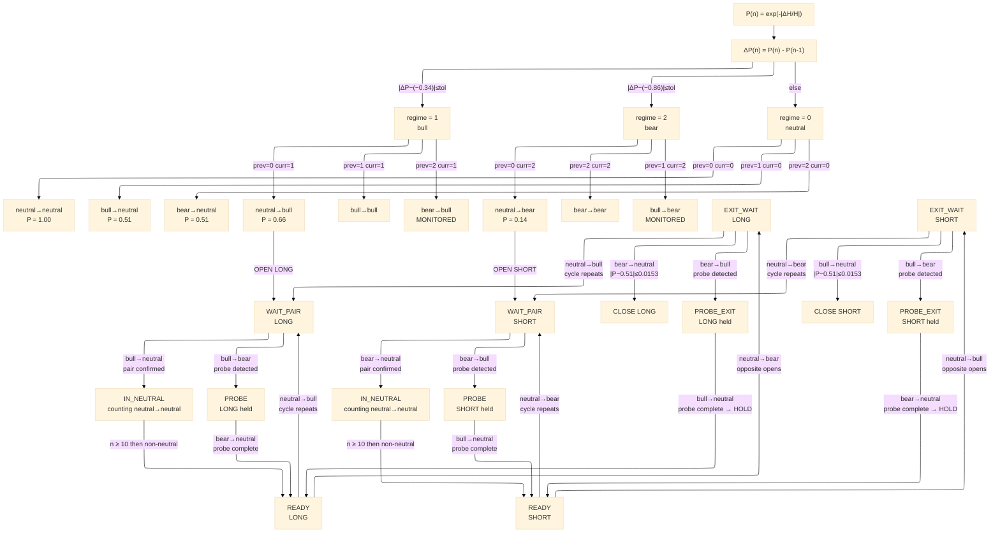

## State Machine Diagram

### State Encoding

| State   | Code |
|---------|------|
| neutral | `00` |
| bull    | `01` |
| bear    | `10` |

Code `11` is undefined and never occurs.

### Transition Encoding

A transition A→B is a **4-bit word** `[a₁a₀b₁b₀]` (from-state | to-state):

The index is `prev_regime × 3 + regime` where `neutral=0, bull=1, bear=2`:

| Index | Transition       | 4-bit word |
|-------|-----------------|------------|
| 0     | neutral→neutral | `0000`     |
| 1     | neutral→bull    | `0001`     |
| 2     | neutral→bear    | `0010`     |
| 3     | bull→neutral    | `0100`     |
| 4     | bull→bull       | `0101`     | — never observed |
| 5     | bull→bear       | `0110`     |
| 6     | bear→neutral    | `1000`     |
| 7     | bear→bull       | `1001`     |
| 8     | bear→bear       | `1010`     | — never observed |

[Read More](https://github.com/quantiota/SKA-quantitative-finance/tree/main/ska_engine_c/binary_transition_space)

### Theoretical Foundation

The market operates as a question-answer structure encoded in 4-bit words. Every sequence is a grammatically complete sentence: a question asked, and an answer given.

The probe sequences (5760 and 10560) with Δp=0 are not anomalies. They are the market's way of saying: "I still need to complete the sentence." Even when there is no net price movement, the market refuses to leave the question unanswered. It goes through the full lawful loop just to give a grammatically correct "No" answer.

This is profound because of the chain rule: the question (neutral→bull or neutral→bear) has been asked. The market must give an answer that belongs to the question. It cannot stay silent or jump randomly. So it produces the probe — a zero-price-change sentence that still obeys the grammar perfectly.

The market needs this question-answer structure more than it needs price movement. Price is secondary. The sentence must be completed.

This is where the variational principle becomes visible: the market is not wandering through the 9 transitions — it follows paths that respect the grammar even when the zero-cost path in price space is available. The market cares more about answering the question correctly than about moving the price.

**Price is the registered answer. The question lives in the transition structure.**

### Version 1

From Wheeler's "It from Bit" — every sequence is a binary question with a binary answer, price is the registred answer.

**Sequences:**
- (39.1%) Question: "Is there buying demand?" `neutral-neutral → neutral-bull`  Answer: "Yes" `bull-neutral → neutral-neutral`  dp=+1  → LONG
- (38.6%) Question: "Is there selling pressure?" `neutral-neutral → neutral-bear`  Answer: "Yes" `bear-neutral → neutral-neutral`  dp=-1  → SHORT

---

### Version 2 — probe-aware, sequence-level decision

Direct jumps (bull-bear, bear-bull) are no longer ignored — they signal a probe sequence and trigger HOLD.

**Probe sequences:**
- (4.1%) Question: "Is there buying demand?" `neutral-neutral → neutral-bull`  Answer: "No" `bull-bear → bear-neutral → neutral-neutral`  dp=0  → HOLD LONG
- (4.4%) Question: "Is there selling pressure?" `neutral-neutral → neutral-bear`  Answer: "No" `bear-bull → bull-neutral → neutral-neutral`  dp=0  → HOLD SHORT

