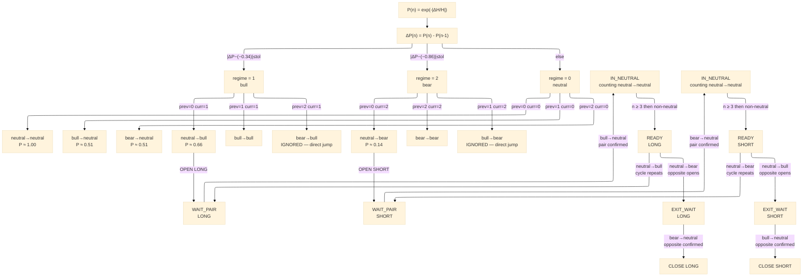

## State Machine Diagram

```mermaid

---
config:
  look: classic
  theme: base
  layout: elk
---
flowchart TD
    P["P(n) = exp(-|ΔH/H|)"]
    DP["ΔP(n) = P(n) - P(n-1)"]

    P --> DP

    DP -->|"|ΔP−(−0.34)|≤tol"| B["regime = 1\nbull"]
    DP -->|"|ΔP−(−0.86)|≤tol"| R["regime = 2\nbear"]
    DP -->|"else"| N["regime = 0\nneutral"]

    N -->|"prev=0 curr=0"| T0["neutral→neutral\nP ≈ 1.00"]
    N -->|"prev=1 curr=0"| T1["bull→neutral\nP ≈ 0.51"]
    N -->|"prev=2 curr=0"| T2["bear→neutral\nP ≈ 0.51"]

    B -->|"prev=0 curr=1"| T3["neutral→bull\nP ≈ 0.66"]
    B -->|"prev=1 curr=1"| T4["bull→bull"]
    B -->|"prev=2 curr=1"| DJ2["bear→bull\nIGNORED — direct jump"]

    R -->|"prev=0 curr=2"| T5["neutral→bear\nP ≈ 0.14"]
    R -->|"prev=2 curr=2"| T6["bear→bear"]
    R -->|"prev=1 curr=2"| DJ1["bull→bear\nIGNORED — direct jump"]

    T3 -->|"OPEN LONG"| WAIT_PAIR_L["WAIT_PAIR\nLONG"]
    T5 -->|"OPEN SHORT"| WAIT_PAIR_S["WAIT_PAIR\nSHORT"]

    WAIT_PAIR_L -->|"bull→neutral\npair confirmed"| IN_N_L["IN_NEUTRAL\ncounting neutral→neutral"]
    WAIT_PAIR_S -->|"bear→neutral\npair confirmed"| IN_N_S["IN_NEUTRAL\ncounting neutral→neutral"]

    IN_N_L -->|"n ≥ 3 then non-neutral"| READY_L["READY\nLONG"]
    IN_N_S -->|"n ≥ 3 then non-neutral"| READY_S["READY\nSHORT"]

    READY_L -->|"neutral→bull\ncycle repeats"| WAIT_PAIR_L
    READY_L -->|"neutral→bear\nopposite opens"| EXIT_L["EXIT_WAIT\nLONG"]
    EXIT_L -->|"bear→neutral\nopposite confirmed"| CLOSE_L["CLOSE LONG"]

    READY_S -->|"neutral→bear\ncycle repeats"| WAIT_PAIR_S
    READY_S -->|"neutral→bull\nopposite opens"| EXIT_S["EXIT_WAIT\nSHORT"]
    EXIT_S -->|"bull→neutral\nopposite confirmed"| CLOSE_S["CLOSE SHORT"]
```