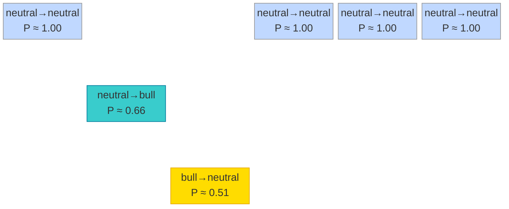

# Structural Probability

## Definition

At each tick n, the SKA API returns an entropy value H (field: `entropy`).
The structural probability P is derived from the relative entropy change between two consecutive ticks:

```
P(n) = exp(−|ΔH/H|)   where   ΔH/H = (H(n) − H(n−1)) / H(n)

P(n) ∈ (0, 1]
```

- `|ΔH/H|` large  →  P close to 0  →  strong structural change
- `|ΔH/H|` small  →  P close to 1  →  entropy barely moving

P is computed by the client from two consecutive `entropy` values returned by the API.


## Regime Classification

Define the tick-level probability variation:

```
δP_tick = P(n) − P(n−1)
```

The regime at tick n is classified as:

```
δP_tick < −0.86                    →  bear    (large drop)
−0.86  ≤  δP_tick  <  −0.34       →  bull    (moderate drop)
δP_tick  ≥  −0.34                  →  neutral
```

Both bull and bear are triggered by a negative δP_tick.
The magnitude of the drop is the only distinction between them.


## Paired Transition Gap

A trade is a **pair of two transitions**: an opening and a closing.
Define the paired transition gap:

```
ΔP_pair = P(closing transition) − P(opening transition)
```

ΔP_pair is not a tick-by-tick quantity. It is the change in P between the
two regime ticks of the same pair.


## ΔP_pair in Each Paired Regime

### Bull pair

```
opening  :  neutral → bull   (LONG pair open)       P ≈ 0.66
closing  :  bull → neutral   (LONG pair confirmed)   P ≈ 0.51

ΔP_pair = 0.51 − 0.66 = −0.15   →   negative
```

P continued to fall between opening and closing.
The closing is not a recovery — it is where the drift slowed below the threshold.


### Bear pair

```
opening  :  neutral → bear   (SHORT pair open)       P ≈ 0.14
closing  :  bear → neutral   (SHORT pair confirmed)   P ≈ 0.51

ΔP_pair = 0.51 − 0.14 = +0.37   →   positive
```

P rebounded between opening and closing.
The closing is an active recovery — the entropy shock has resolved.


## The Opposite Sign

| Pair  | P at opening | P at closing | ΔP_pair    | Nature                  |
|-------|-------------|--------------|------------|-------------------------|
| Bull  | ≈ 0.66      | ≈ 0.51       | **−0.15**  | drift — P falls through |
| Bear  | ≈ 0.14      | ≈ 0.51       | **+0.37**  | shock — P snaps back    |

Both pairs open with a negative δP_tick.
In the observed data, bull pairs satisfy `ΔP_pair < 0` while bear pairs satisfy
`ΔP_pair > 0`. This empirical sign separation distinguishes a sustained entropy
drift from a brief entropy shock.


## Regime Transitions

### Pair events

| Code | Transition     | Event                   |
|------|----------------|-------------------------|
| 1    | neutral → bull | LONG pair open          |
| 3    | bull → neutral | LONG pair confirmation  |
| 2    | neutral → bear | SHORT pair open         |
| 6    | bear → neutral | SHORT pair confirmation |

### Full trade logic

A trade does not open on the pair open event alone.
The full state machine requires:

```
LONG:
  neutral → bull             LONG pair open        (WAIT_PAIR)
  bull → neutral             pair confirmed         (IN_NEUTRAL)
  neutral × N  (N ≥ 3)       neutral gap            (READY)
  neutral → bear             opposite pair opens    (EXIT_WAIT)
  bear → neutral             opposite confirmed     → CLOSE LONG

SHORT: mirror logic.
```


## P Band Structure

P band positions are **universal constants** of the SKA entropy geometry — identical across all assets and exchanges once the input scale reaches convergence.

| Transition      | P (converged) | Role                        |
|-----------------|---------------|-----------------------------|
| neutral→neutral | ≈ 1.00        | entropy at rest             |
| neutral→bull    | ≈ 0.66        | entropy drift opening       |
| bull→neutral    | ≈ 0.51        | entropy drift closing       |
| bear→neutral    | ≈ 0.51        | entropy shock closing       |
| neutral→bear    | ≈ 0.14        | entropy shock opening       |

Confirmed on XRPUSDT (scale=50,000) and BTCUSDT (scale=500,000) — same values.

The **convergence scale** is asset-specific (determined by tick/price ratio). The **band positions** at convergence are asset-independent.

### The 1-bit closing boundary

At the closing of both paired transitions, P ≈ 0.51 ≈ 0.5:

```
exp(−|ΔH/H|) = 0.5  →  |ΔH/H| = ln(2)
```

ln(2) is **1 bit of information** — the Shannon entropy of a fair coin flip.
Both bull and bear pairs close exactly when the entropy change reaches 1 bit:
the natural information-theoretic boundary between structured and random regimes.


## Constants

| Constant        | Value | Description                                      |
|-----------------|-------|--------------------------------------------------|
| BULL_THRESHOLD  | 0.34  | = P(neutral→neutral) − P(neutral→bull) = 1.00 − 0.66 |
| BEAR_THRESHOLD  | 0.86  | = P(neutral→neutral) − P(neutral→bear) = 1.00 − 0.14 |
| MIN_NEUTRAL_GAP | 3     | minimum neutral ticks before READY state         |


## Asset and Exchange Independence

The trading bot operates entirely on the entropy signal:

```
H(n)  →  ΔH/H  →  P(n)  →  ΔP(n)  →  regime  →  trade decision
```

It never observes price direction, orderbook, spread, or exchange microstructure.
All exchange-specific details (WebSocket protocol, symbol format, timestamp precision)
are absorbed in the streaming layer and learning engine.

### Why the invariant holds

P = exp(−|ΔH/H|) measures the *relative* entropy change — dividing by H(n) removes
any dependency on absolute price level. Whether the asset trades at $1.40 or $85,000,
the P bands converge to the same values.

The thresholds and band positions are **universal constants** — they never need
recalibration per asset:

| Parameter       | Value |
|-----------------|-------|
| BULL_THRESHOLD  | 0.34  |
| BEAR_THRESHOLD  | 0.86  |
| P_NEUTRAL_BULL  | 0.66  |
| P_X_NEUTRAL     | 0.51  |
| P_NEUTRAL_BEAR  | 0.14  |

### Live proof

ΔP_pair measured on XRPUSDT across 13 consecutive loops (2026-03-22):

```
bear ΔP_pair:  +0.361 … +0.376   mean ≈ +0.370   std ≈ ±0.004
theoretical:   P_X_NEUTRAL − P_NEUTRAL_BEAR = 0.51 − 0.14 = +0.370
```

The live measurement matches the theoretical constant to 3 decimal places.

**Confirmed independent of:**
- Asset (XRPUSDT vs BTCUSDT — 60,000× price difference)


**Pending validation:**
- Exchange independence (Binance → Coinbase)

## P Trajectory — Trade Sequence
The diagrams below are built in the probability space across the trade ID sequence.


## P Trajectory — Bull Cycle on Probability Space



 <br>
  <br>

 ## P Trajectory — Bull Trends on Probability Space
```mermaid 
     block-beta                                                                                                                                                 
    columns 12                                                                                                                                               
    B4["neutral→neutral\nP ≈ 1.00"] B5["neutral→neutral\nP ≈ 1.00"] B6["neutral→neutral\nP ≈ 1.00"] B1["neutral→neutral\nP ≈ 1.00"] space space              
  B10["neutral→neutral\nP ≈ 1.00"] B11["neutral→neutral\nP ≈ 1.00"] B12["neutral→neutral\nP ≈ 1.00"] B7["neutral→neutral\nP ≈ 1.00"] space space             
    space:12                                                                                                                                               
    space space space space B2["neutral→bull\nP ≈ 0.66"] space space space space space B8["neutral→bull\nP ≈ 0.66"] space                                    
    space:12                                                                                                                                               
    space space space space space B3["bull→neutral\nP ≈ 0.51"] space space space space space B9["bull→neutral\nP ≈ 0.51"]                                    
                                                                                                                                                             
    classDef nn fill:#c0d8ff,stroke:#999,color:#333                                                                                                          
    classDef nb fill:#39cccc,stroke:#007c9e,color:#fff                                                                                                       
    classDef bn fill:#ffdc00,stroke:#e6a800,color:#333                                                                                                       
                                                                                                                                                           
    class B1,B4,B5,B6,B7,B10,B11,B12 nn                                                                                                                      
    class B2,B8 nb
    class B3,B9 bn                                                                                                                                           
                                                                                                                                                              
                 
 ```
 <br>
  <br>

## P Trajectory — Bear Cycle on Probability Space

```mermaid
block-beta
  columns 6
  C1["neutral→neutral\nP ≈ 1.00"] space space C4["neutral→neutral\nP ≈ 1.00"] C5["neutral→neutral\nP ≈ 1.00"] C6["neutral→neutral\nP ≈ 1.00"]
  space:6
  space space C3["bear→neutral\nP ≈ 0.51"] space space space
  space:6
  space C2["neutral→bear\nP ≈ 0.14"] space space space space

  classDef nn fill:#c0d8ff,stroke:#999,color:#333
  classDef nb2 fill:#f012be,stroke:#c00090,color:#fff
  classDef bn2 fill:#ff851b,stroke:#cc5500,color:#333

  class C1,C4,C5,C6 nn
  class C2 nb2
  class C3 bn2
```
 <br>
  <br>
 
## P Trajectory — Bear Trends on Probability Space

```mermaid
 block-beta                                                                                                                                                 
    columns 12                                                                                                                                               
    C4["neutral→neutral\nP ≈ 1.00"] C5["neutral→neutral\nP ≈ 1.00"] C6["neutral→neutral\nP ≈ 1.00"] C1["neutral→neutral\nP ≈ 1.00"] space space              
  C10["neutral→neutral\nP ≈ 1.00"] C11["neutral→neutral\nP ≈ 1.00"] C12["neutral→neutral\nP ≈ 1.00"] C7["neutral→neutral\nP ≈ 1.00"] space space             
    space:12                                                                                                                                               
    space space space space space C3["bear→neutral\nP ≈ 0.51"] space space space space space C9["bear→neutral\nP ≈ 0.51"]                                    
    space:12                                                                                                                                               
    space space space space C2["neutral→bear\nP ≈ 0.14"] space space space space space C8["neutral→bear\nP ≈ 0.14"] space
                                                                                                                                                             
    classDef nn fill:#c0d8ff,stroke:#999,color:#333                                                                                                          
    classDef nb2 fill:#f012be,stroke:#c00090,color:#fff                                                                                                      
    classDef bn2 fill:#ff851b,stroke:#cc5500,color:#333                                                                                                      
                                                                                                                                                           
    class C1,C4,C5,C6,C7,C10,C11,C12 nn                                                                                                                      
    class C2,C8 nb2
    class C3,C9 bn2 

  ```
 <br>
  <br>
  
## State Machine Diagram

```mermaid
flowchart TD
    P["P(n) = exp(-|ΔH/H|)"]
    DP["ΔP(n) = P(n) - P(n-1)"]

    P --> DP

    DP -->|"ΔP ≥ -0.34"| N["regime = 0\nneutral"]
    DP -->|"-0.86 ≤ ΔP < -0.34"| B["regime = 1\nbull"]
    DP -->|"ΔP < -0.86"| R["regime = 2\nbear"]

    N -->|"prev=0 curr=0"| T0["neutral→neutral\nP ≈ 1.00"]
    N -->|"prev=1 curr=0"| T1["bull→neutral\nP ≈ 0.51"]
    N -->|"prev=2 curr=0"| T2["bear→neutral\nP ≈ 0.51"]

    B -->|"prev=0 curr=1"| T3["neutral→bull\nP ≈ 0.66"]
    B -->|"prev=1 curr=1"| T4["bull→bull"]

    R -->|"prev=0 curr=2"| T5["neutral→bear\nP ≈ 0.14"]
    R -->|"prev=2 curr=2"| T6["bear→bear"]

    T3 -->|"OPEN LONG"| WAIT_PAIR_L["WAIT_PAIR\nLONG"]
    T5 -->|"OPEN SHORT"| WAIT_PAIR_S["WAIT_PAIR\nSHORT"]

    WAIT_PAIR_L -->|"bull→neutral\npair confirmed"| IN_N_L["IN_NEUTRAL\ncounting neutral→neutral"]
    WAIT_PAIR_S -->|"bear→neutral\npair confirmed"| IN_N_S["IN_NEUTRAL\ncounting neutral→neutral"]

    IN_N_L -->|"n ≥ 3 then non-neutral"| READY_L["READY\nLONG"]
    IN_N_S -->|"n ≥ 3 then non-neutral"| READY_S["READY\nSHORT"]

    READY_L -->|"neutral→bull\ncycle repeats"| WAIT_PAIR_L
    READY_L -->|"neutral→bear\nopposite opens"| EXIT_L["EXIT_WAIT\nLONG"]
    EXIT_L -->|"bear→neutral\nopposite confirmed"| CLOSE_L["CLOSE LONG"]

    READY_S -->|"neutral→bear\ncycle repeats"| WAIT_PAIR_S
    READY_S -->|"neutral→bull\nopposite opens"| EXIT_S["EXIT_WAIT\nSHORT"]
    EXIT_S -->|"bull→neutral\nopposite confirmed"| CLOSE_S["CLOSE SHORT"]
```
